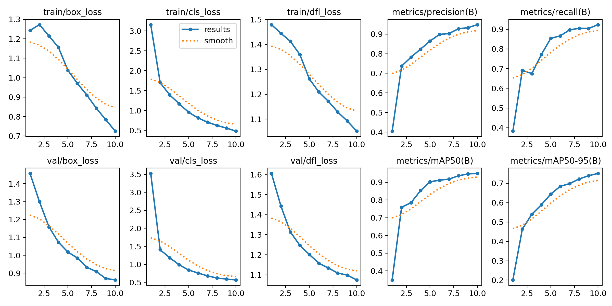
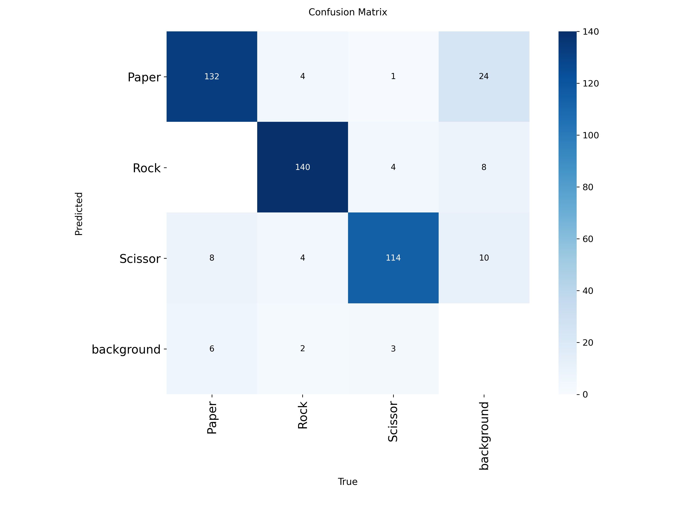

# 📓 YOLOv8 Training & Real-Time Inference

---

## 1. Introduction

* Short explanation of YOLOv8 and its use cases.
* Workflow overview: **dataset → training → evaluation → visualization → real-time inference**.

---

## 2. Setup

* Install and import required libraries (Roboflow, Ultralytics, OpenCV, Matplotlib).
* Environment check.

---

## 3. Dataset Preparation

* Download dataset from **Roboflow** (Rock-Paper-Scissors).
* Split into `train`, `val`, and `test`.
* Generate `data.yaml` file with paths and class names.

---

## 4. Training YOLOv8

* Initialize model (e.g., `yolov8n.pt`).
* Train on dataset (epochs, batch size, image size).
* Store outputs in structured folders.

---

## 5. Training Results Visualization

* Display `results.png` (training curves).

* Display `confusion_matrix.png` (class-wise evaluation).
* 
* Interpret metrics briefly.

---

## 6. Model Evaluation

* Load trained weights (`best.pt`).
* Run inference on test set.
* Save results into prediction folder.

---

## 7. **Images Section (Visualization of Predictions)**

This section focuses only on **visual results**:

---

## 8. Real-Time Camera Inference

* Open webcam feed.
* Run model on live frames.
* Draw bounding boxes, labels, confidence scores.
* Show FPS counter.
* Exit with “q” key.

